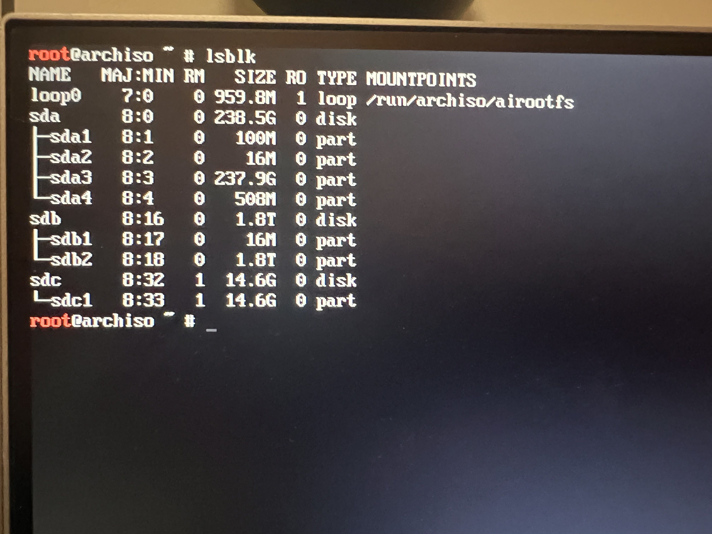
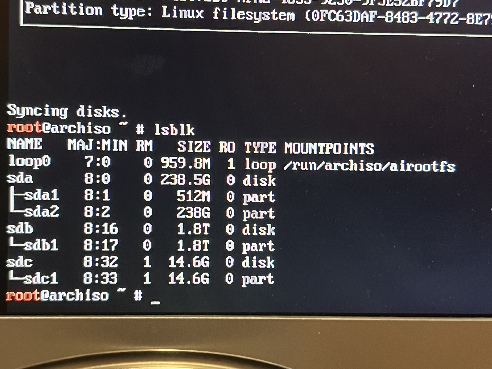

# Initial Setup of Arch Linux

1. Create a bootable USB drive with the Arch Linux ISO.

- Use Rufus with the following settings:
  - Boot selection: Disk or ISO image (Please select) `archlinux-2025.08.01-x86_64.iso`
  - Persistent partition size: 0 MB (no persistence needed for installation)
  - Partition scheme: MBR (for compatibility with most systems)
  - Target system: BIOS (or UEFI-CSM)
  - File system: FAT32 for the EFI System Partition

2. Boot from the USB drive and select the Arch Linux installation option.

3. Connect to the internet using `iwctl`

- `device list` to list devices
- `station <device> scan` to scan for networks
- `station <device> get-networks` to list available networks
- `station <device> connect <SSID>` to connect to a network
- `ping archlinux.org` to verify internet connectivity

4. Check the current disk layout using `lsblk`

- image below shows the disk layout with SSD and HDD
- 
- loop0: ISO image (read-only squashfs loaded from the USB)
- sda: 256GB SSD (currently Windows/GPT layout)
  - sda1 100M EFI System Partition (FAT32)
  - sda2 16M Microsoft Reserved (MSR)
  - sda3 ~238G Windows main partition
  - sda4 500M Windows recovery
- sdb: 2TB HDD (data)
  - sdb1 16M small leftover partition
  - sdb2 ~1.8T data partition
- sdc: 16GB USB installer (your Arch media)

5. Use wipefs to clear the SSD and HDD

- `wipefs -a /dev/sda` to clear the SSD
- `wipefs -a /dev/sdb` to clear the HDD
- This removes all existing filesystem signatures, preparing the disks for new partitions.

5. Partition the SSD and HDD using `cfdisk`

- `/dev/sda` (choose gpt):
  - 512M Type: EFI System
  - Rest Type: Linux filesystem (root)
- `/dev/sdb` (gpt):
  - Full Type: Linux filesystem (/home or data)
    (Swap partition not required; we will use swapfile + zram.)

6. Format the partitions using `mkfs`

- We are using `ext4` for current setup as I want to keep it simple as first. Potentially, we can use `btrfs` or `zfs` in the future for features like snapshots.
- `mkfs.fat -F32 /dev/sda1` to format the EFI System Partition using FAT32
- `mkfs.ext4 -L root /dev/sda2` to format the root partition on the SSD
- `mkfs.ext4 -L home /dev/sdb1` to format the home partition on the HDD
- `mount /dev/sda2 /mnt` to mount the root partition
- `mkdir -p /mnt/boot /mnt/home` to create a mount point for the home partition and boot partition
- `mount /dev/sda1 /mnt/boot` to mount the EFI System Partition
- `mount /dev/sdb1 /mnt/home` to mount the home partition
  

7. Install the base system using `pacstrap`

- `pacstrap -K /mnt base linux linux-firmware`

8. Generate the fstab (File Systems Table) file using `genfstab`

- `genfstab -U /mnt >> /mnt/etc/fstab` to generate the fstab file
- Verify the fstab file with `cat /mnt/etc/fstab` to ensure it contains the correct entries for the mounted partitions.

9. Chroot into the new system (change root to the new installation)

- `arch-chroot /mnt` to enter the new system environment

10. Set the time zone

- `ln -sf /usr/share/zoneinfo/Australia/Sydney /etc/localtime` to set the time zone
- `hwclock --systohc` to synchronize the hardware clock with the system clock
- Check the time zone with `date` to ensure it is set correctly.

11. Set the region and language

- `locale-gen` to generate the locale files
- Edit `/etc/locale.conf` to set the locale, e.g., `LANG=en_UK.UTF-8`
- Create `/etc/vconsole.conf` to set the keyboard layout, e.g., `KEYMAP=us`
- Set the hostname by editing `/etc/hostname`, e.g., `myarch`

12. Initialize the initramfs

- A RAM filesystem that kernel use during boot
- `mkinitcpio -P` to generate the initial RAM disk images

13. Set the root password

- `passwd` to set the root password for the new system

14. Install the bootloader

- For UEFI systems, install `grub` and `efibootmgr`:
- `pacman -S grub efibootmgr`
- `grub-install --target=x86_64-efi --efi-directory=/boot --bootloader-id=GRUB --recheck`

15. Reboot the system

- Exit the chroot environment with `exit`
- Unmount the partitions with `umount -R /mnt`
- Reboot the system with `reboot`

### Unexpected issues

- Forgot to install `NetworkManager` for network management, which casused issues with network connectivity after reboot.
- Solution: Reboot into the live USB,

1. Mount the root partition with `mount /dev/sda2 /mnt`
2. Mount the boot partition with `mount /dev/sda1 /mnt/boot`
3. Mount the home partition with `mount /dev/sdb1 /mnt/home`
4. Chroot into the system with `arch-chroot /mnt`

## Connect to Uni WiFi

- Knowing that the Uni WiFi uses WPA2 Enterprise, I need to set up a profile for it.

1. `nmcli connection add type wifi ifname "*" con-name eduroam ssid eduroam`
2. Set the security Settings for the WiFi connection:

```bash
nmcli connection modify eduroam \
  wifi-sec.key-mgmt wpa-eap \
  802-1x.eap peap \
  802-1x.phase2-auth mschapv2 \
  802-1x.identity "zID@ad.unsw.edu.au" \
  802-1x.anonymous-identity "anonymous@ad.unsw.edu.au" \
  802-1x.password "YourPassword"
```

3. `nmcli connection up eduroam` to activate the connection
4. Verify the connection with `nmcli connection show` to ensure it is active.

## Current installation list

1. Base system: `base`, `linux`, `linux-firmware`
2. Bootloader: `grub`, `efibootmgr`
3. Network management: `networkmanager`
